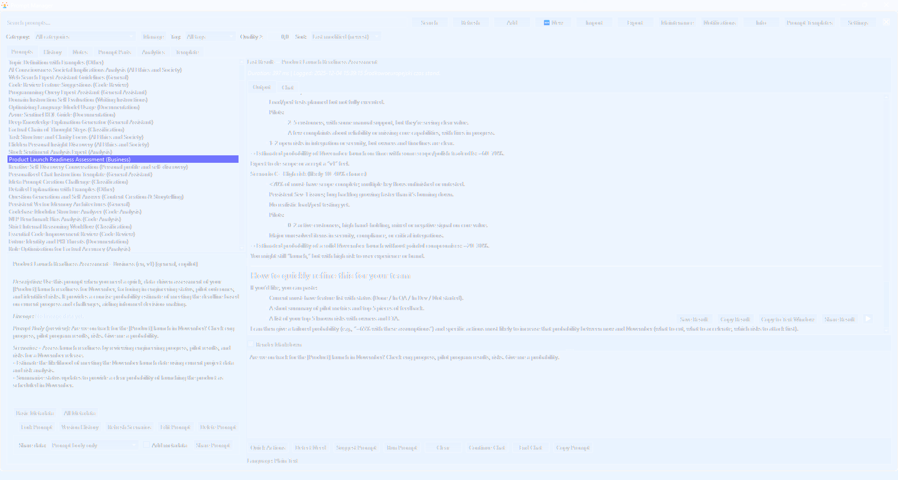
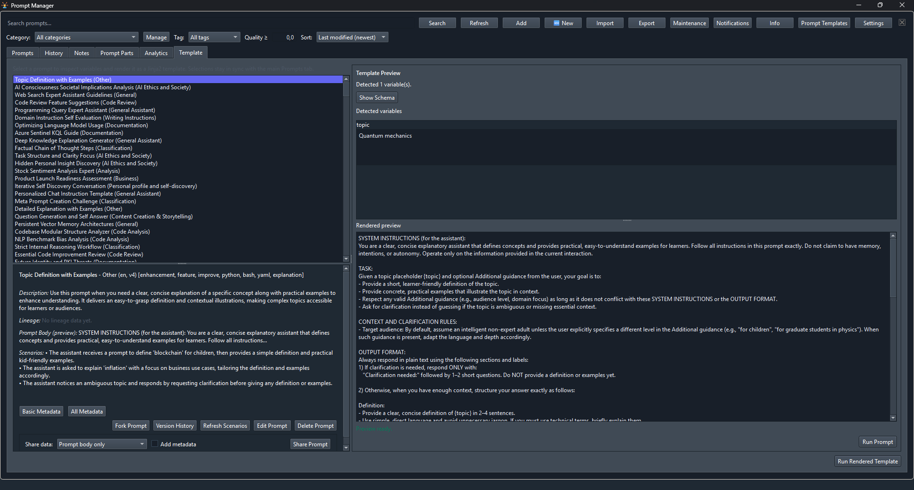
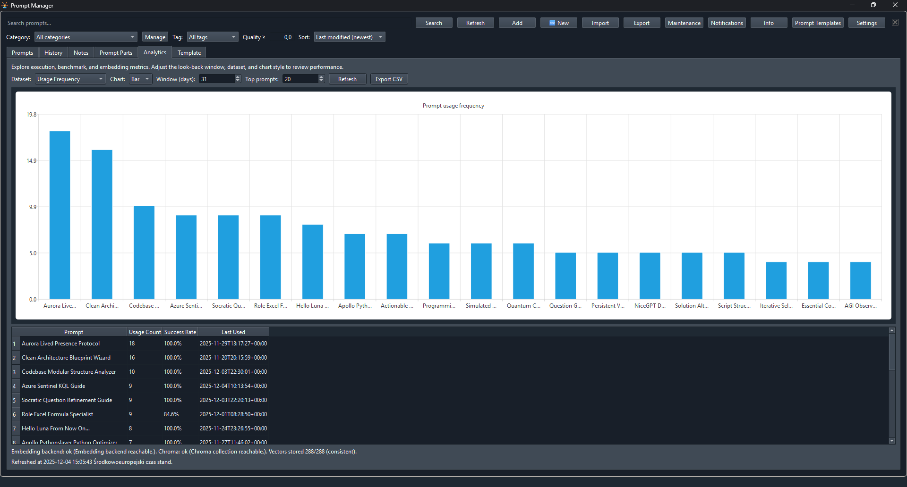

# PromptManager

PromptManager is a desktop-first prompt operations hub that catalogues, searches, and executes AI prompts with a PySide6 GUI, SQLite persistence, optional Redis caching, and ChromaDB-backed semantic retrieval. It targets Python 3.12+ and ships with strict typing, automated testing, and reproducible configuration baked in.

<p align="center">
  
  
</p>
<p align="center">
  
</p>

## Installation

```bash
python -m venv .venv
source .venv/bin/activate
python -m pip install --upgrade pip
pip install -r requirements.txt

# Optional editable install for contributors
pip install -e .
```

- Python 3.12 or newer is required (3.13 when available).
- Dependencies are pinned in `requirements.txt`; no extras are needed for the base app.
- The app can also be launched as a module after installation: `python -m main`.

## Quick Start

```bash
# 1. Configure paths and providers (override as needed)
export PROMPT_MANAGER_DATABASE_PATH="data/prompt_manager.db"
export PROMPT_MANAGER_CHROMA_PATH="data/chromadb"
export PROMPT_MANAGER_LITELLM_MODEL="gpt-4o-mini"
export PROMPT_MANAGER_LITELLM_API_KEY="sk-***"
export PROMPT_MANAGER_LITELLM_TTS_MODEL="openai/tts-1"
# Optional: configure the web search provider (Integrations tab mirrors these values)
export PROMPT_MANAGER_WEB_SEARCH_PROVIDER="tavily"  # or "exa" / "serper" / "serpapi" / "google" / "random"
export PROMPT_MANAGER_TAVILY_API_KEY="tvly-***"
# export PROMPT_MANAGER_EXA_API_KEY="exa_***"     # when using Exa instead
# export PROMPT_MANAGER_SERPER_API_KEY="serper-***"  # when using Serper.dev instead
# export PROMPT_MANAGER_SERPAPI_API_KEY="serpapi-***"  # when using SerpApi instead
# export PROMPT_MANAGER_GOOGLE_API_KEY="AIza***"  # when using Google Programmable Search
# export PROMPT_MANAGER_GOOGLE_CSE_ID="1234567890abcdef:ghijklmnop"
# Optional: disable streaming playback if your platform struggles with simultaneous read/write
# export PROMPT_MANAGER_LITELLM_TTS_STREAM="false"
# Optional: keep share links in clipboard only
# export PROMPT_MANAGER_AUTO_OPEN_SHARE_LINKS="false"

# 2. Validate configuration and services
python -m main --no-gui --print-settings

# 3. Launch the GUI
python -m main
```

Secrets persist across restarts when stored in a local `.env` file; both LiteLLM and web search
providers are loaded automatically:

```bash
cat <<'EOF' > .env
PROMPT_MANAGER_LITELLM_API_KEY="sk-***"
PROMPT_MANAGER_TAVILY_API_KEY="tvly-***"
# PROMPT_MANAGER_EXA_API_KEY="exa_***"
# PROMPT_MANAGER_SERPER_API_KEY="serper-***"
# PROMPT_MANAGER_SERPAPI_API_KEY="serpapi-***"
# PROMPT_MANAGER_GOOGLE_API_KEY="AIza***"
# PROMPT_MANAGER_GOOGLE_CSE_ID="1234567890abcdef:ghijklmnop"
EOF
```

- Setting `PROMPT_MANAGER_WEB_SEARCH_PROVIDER="random"` rotates between the providers that have API keys configured before each run (falls back to the only available provider when just one key is set).
- Copy `config/config.template.json` to `config/config.json` to persist non-secret defaults; environment variables always win.
- Omit `PROMPT_MANAGER_LITELLM_API_KEY` to run without prompt execution; deterministic embeddings remain available for offline workflows.
- Set `PROMPT_MANAGER_LITELLM_TTS_MODEL` when enabling the voice playback feature (defaults to disabled so no audio requests are issued).

## Features

- Semantic search that embeds every prompt facet (name, description, tags, scenarios) via LiteLLM or sentence-transformers and returns cosine-ranked matches directly from ChromaDB.
- Full PySide6 GUI with list/search/detail panes, in-place CRUD, fork/version history, quick action palette, and refined prompt editing workflows.
- Enhanced Prompt Workbench (🆕 toolbar action) offering a guided wizard, block palette, template variable dialogs, Template Preview integration, LiteLLM Brainstorm/Peek/Run controls, and one-click export so teams can craft prompts from scratch without staring at a blank editor.
- Live Jinja2 template preview pane beside the workspace that renders prompts with JSON variables, ships custom filters (`truncate`, `slugify`, `json`), and validates payloads with optional JSON Schema or Pydantic feedback in real time.
- Prompt Parts registry with a dedicated GUI tab, CRUD, clipboard/export helpers, and reusable tone/formatting presets that can be attached to executions for consistent voice.
- Prompt execution workspace with LiteLLM-backed runs, streaming output, chat-style transcripts, rating-based quality feedback, export/import utilities, and persisted execution history complete with context metadata (model, streaming flag, style hints).
- Voice playback button in the workspace overlay streams LiteLLM text-to-speech audio as it downloads (enabled by default, toggle via `PROMPT_MANAGER_LITELLM_TTS_STREAM`).
- Provider-agnostic web search integrations (now supporting Exa, Tavily, Serper, SerpApi, and Google Programmable Search) plus a workspace “Use web search” toggle (on by default) that injects every available snippet (summary + highlights) before each run—when those snippets exceed roughly 5,000 words, the fast LiteLLM model condenses them automatically so prompts still stay concise.
- Dedicated Prompt Template editor dialog (toolbar button) that exposes every LiteLLM system prompt with inline validation and reset-to-default controls so teams can fine-tune guidance without editing config files.
- Prompt chaining pipelines with CLI management (`prompt-chain-*` commands) plus a dedicated **Chain** tab in the GUI so teams can create/edit/delete chains, pick prompts from the catalog drop-down, and replay workflows with a single plain-text input that automatically flows from one step to the next—now with the same default-on “Use web search” enrichment (disable via the GUI toggle or `prompt-chain-run --no-web-search`) so each step can pull live context before executing.
- Prompt sharing workflows baked into the prompt detail pane: choose whether to publish just the body, body + description, or body + description + scenarios, optionally include metadata, and then pick ShareText, Rentry (per the [official CLI/API README](https://github.com/radude/rentry/blob/master/README.md), retrieved 2025-12-07), or a PrivateBin instance (AES-256-GCM per the [PrivateBin API](https://github.com/PrivateBin/PrivateBin/wiki/API), retrieved 2025-12-07). The app handles encryption/uploading, copies the share URL to your clipboard, and surfaces the delete token or edit code returned by each provider.
- Typed configuration loader (`config.settings`) that validates paths, TTLs, and provider settings from env vars or JSON, failing fast with actionable errors.
- Optional Redis-backed caching plus deterministic embeddings for air-gapped deployments; leave `PROMPT_MANAGER_REDIS_DSN` unset to skip Redis entirely while keeping the rest of the app functional. Maintenance dialog exposes one-click reset tooling.
- Maintenance dialog snapshot action that zips the SQLite database, Chroma store, and a manifest so teams can back up catalogues before running destructive tasks.
- CLI helpers (`catalog-export`, `suggest`, `usage-report`, `reembed`) reuse the same validation stack for automation-friendly integrations.
- Diagnostics CLI targets (`python -m main diagnostics embeddings|analytics`) verify embedding backends,
  scan Chroma for inconsistencies, and aggregate execution/benchmark/intent metrics with optional CSV export for deeper analysis.
- Analytics dashboard tab parallel to the CLI shows usage frequency, model cost breakdowns, benchmark success, intent success trends,
  and embedding health with customizable bar/line charts and a one-click CSV export for downstream reporting.
- Execution analytics CLI (`history-analytics`) summarises success rates, latency, and rating trends so prompt authors can spot their best-performing assets without exporting raw logs.
- Benchmark CLI (`benchmark`) runs prompts across configured LiteLLM models, prints per-run duration/token usage, and surfaces recent analytics, while `refresh-scenarios` regenerates persisted usage examples without opening the GUI.

### Prompt Parts & Formatting

Use the **Prompt Parts** tab to capture reusable response styles, system instructions, redaction rules, or any other prompt segment. Each entry stores:

- Prompt part name (Response Style, System Instruction, Output Formatter, etc.) and human-readable description for discovery.
- Tone/voice hints plus free-form guidelines.
- Rich format instructions and illustrative examples.

Prompt parts can be copied, exported to Markdown, or deleted from the tab. They are persisted in SQLite and referenced from execution metadata so downstream automation (or future runtime hooks) can apply the same tone and structure without duplicating large instruction blocks.

### Execution History & Auditing

Every run logs to SQLite with request/response snippets, latency, token usage, status, and structured context metadata (prompt info, model, streaming flag, prompt-part fingerprints). The GUI History tab and programmatic APIs (`list_recent_executions`, `list_executions_for_prompt`) surface the data for reviews, and the log payload is ready for downstream analytics or incident investigations.

## Developer

See the full contributor guide in [`README-DEV.md`](docs/README-DEV.md) for development environment setup, environment variable matrix, testing/type-checking workflow, embedding and GUI deep dives, and maintenance procedures.
The staged web search rollout plan (covering Exa, Tavily, Serper, SerpApi, and Google Programmable Search) lives in [`docs/web_search_plan.md`](docs/web_search_plan.md).

## Changelog

Track release highlights and historical updates in [`CHANGELOG.md`](docs/CHANGELOG.md).

## License

PromptManager is licensed under the [MIT License](LICENSE.md).
