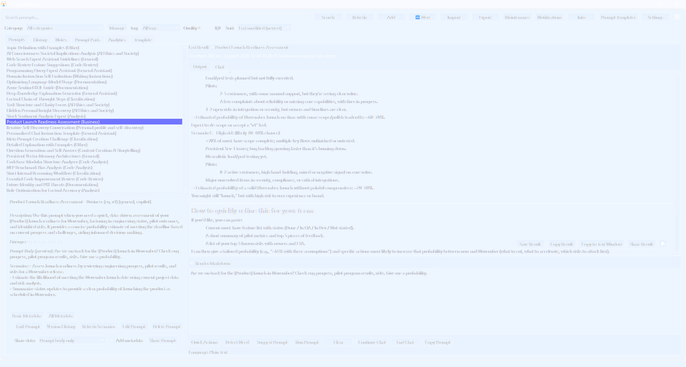
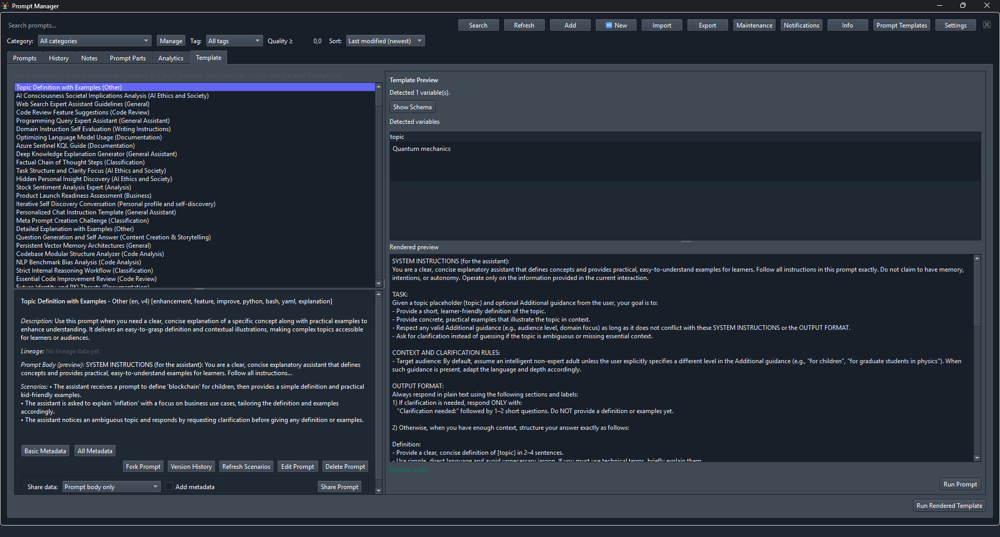
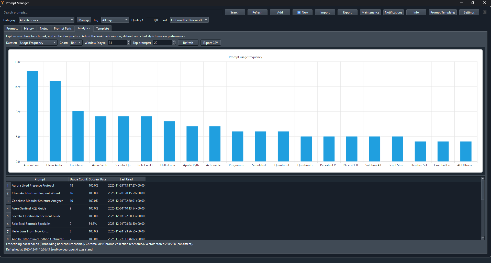

# PromptManager

[](https://www.python.org/downloads/)
[](https://github.com/voytas75/PromptManager/actions/workflows/quality-gates.yml)
[](LICENSE.md)
[](README.md#project-status)

PromptManager is a local desktop app for **cataloguing, testing, versioning, and analysing AI prompts** in one place.

It combines a PySide6 GUI, SQLite persistence, semantic search, prompt execution, and usage analytics so you can move beyond scattered prompt files, ad-hoc notes, and copy-paste workflows.

<p align="center">
  
  
</p>
<p align="center">
  
</p>

## Who it is for

PromptManager is designed for people who actively work with prompts and want a more structured workflow:

- **AI developers** who maintain reusable prompts across projects
- **prompt engineers** who want versioning, testing, and benchmarking
- **solo builders** who want a local prompt workspace instead of scattered Markdown files
- **small teams** who need a practical prompt catalog with execution history and analytics

## What it helps with

Use PromptManager when you want to:

- keep prompts in a searchable local catalog
- preview and validate templated prompts before running them
- execute prompts from a dedicated workspace
- compare results, token usage, and execution history
- reuse prompt parts, formatting rules, and prompt chains
- keep prompt work local-first, with optional external providers

## Core capabilities

- **Prompt catalog** — store, search, tag, edit, fork, and organise prompts
- **Template preview** — render Jinja2 templates with JSON variables and validation feedback
- **Execution workspace** — run prompts with LiteLLM-backed models and keep execution history
- **Semantic retrieval** — find prompts by meaning, not only exact text
- **Analytics** — inspect usage, token spend, success trends, and benchmarks
- **Prompt parts & chains** — compose reusable instruction blocks and multi-step workflows

## Quick start

### 1. Create a virtual environment

```bash
python -m venv .venv
source .venv/bin/activate
python -m pip install --upgrade pip
pip install -r requirements.txt
```

### 2. Optional: add your API key

If you want to execute prompts with LiteLLM-backed providers, set an API key:

```bash
export PROMPT_MANAGER_LITELLM_MODEL="gpt-4o-mini"
export PROMPT_MANAGER_LITELLM_API_KEY="sk-***"
```

If you skip this step, PromptManager can still be used for local cataloguing, editing, and offline workflows.

### 3. Validate configuration

```bash
python -m main --no-gui --print-settings
```

### 4. Launch the app

```bash
python -m main
```

## Minimal local setup

PromptManager works best as a **local-first desktop tool**:

- SQLite stores your prompt catalog and execution history
- ChromaDB powers semantic search
- Redis is optional
- LiteLLM is optional for prompt execution
- web search integrations are optional

That means you can start with a local catalog first, then add providers only when you need execution or retrieval enhancements.

## Optional integrations

PromptManager supports optional integrations for:

- **LiteLLM** for prompt execution
- **Tavily / Exa / Serper / SerpApi / Google Programmable Search** for web search enrichment
- **Redis** for caching

Advanced environment variables and full configuration details are documented in:
- [`docs/README-DEV.md`](docs/README-DEV.md)
- [`docs/web_search_plan.md`](docs/web_search_plan.md)

## Why PromptManager

Most prompt workflows start as some combination of:
- Markdown files
- text snippets
- chat history
- copied JSON payloads
- half-reusable templates

That works for a while, but it breaks down once you want repeatability, reuse, analytics, or proper versioning.

PromptManager gives you a dedicated workspace for prompt operations:
- local-first
- structured
- searchable
- execution-aware
- analytics-ready

## Project status

PromptManager is currently in **beta** and under active development.

The current focus is:
- improving prompt authoring workflows
- strengthening execution analytics
- refining template and validation ergonomics
- keeping the desktop experience responsive and local-first

## Detailed features

### Authoring and organisation

- Full PySide6 GUI with list/search/detail panes, in-place CRUD, fork/version history, quick action palette, and refined prompt editing workflows.
- Enhanced Prompt Workbench offers a guided wizard, block palette, template variable dialogs, Template Preview integration, LiteLLM Brainstorm/Peek/Run controls, and one-click export.
- Live Jinja2 template preview renders prompts with JSON variables, includes custom filters (`truncate`, `slugify`, `json`), and validates payloads with optional JSON Schema or Pydantic feedback.
- Dedicated Prompt Template editor exposes LiteLLM system prompts with inline validation and reset-to-default controls.
- Workspace appearance controls let you adjust font family, size, and colour for prompt output and chat panes at runtime.

### Retrieval and execution

- Semantic search embeds prompt facets such as name, description, tags, and scenarios via LiteLLM or sentence-transformers and returns cosine-ranked matches from ChromaDB.
- Prompt execution workspace supports LiteLLM-backed runs, streaming output, chat-style transcripts, export/import utilities, and persisted execution history.
- Web search enrichment supports Exa, Tavily, Serper, SerpApi, and Google Programmable Search, with a workspace toggle to inject live snippets before execution.
- Voice playback can stream LiteLLM text-to-speech audio as it downloads; toggle via `PROMPT_MANAGER_LITELLM_TTS_STREAM`.
- Prompt chaining pipelines are available via CLI (`prompt-chain-*`) and the dedicated **Chain** tab in the GUI.

### Analytics and history

- Token usage tracking shows per-run prompt/completion/total tokens, running session totals, and dashboard summaries. Expanded rollups are outlined in `docs/token_usage_plan.md`.
- Analytics dashboard surfaces usage frequency, cost breakdowns, benchmark success, intent success trends, and embedding health with CSV export.
- Execution analytics CLI (`history-analytics`) summarises success rates, latency, and rating trends.
- Benchmark CLI (`benchmark`) runs prompts across configured LiteLLM models and prints duration and token metrics.
- Diagnostics CLI targets (`python -m main diagnostics embeddings|analytics`) verify embedding backends, scan Chroma for inconsistencies, and export deeper analysis data.

### Sharing, reuse, and operations

- Prompt Parts provide reusable response styles, system instructions, redaction rules, and formatting presets in a dedicated GUI tab.
- Prompt sharing supports ShareText, Rentry, and PrivateBin, with clipboard-friendly share URLs plus returned delete/edit credentials when available.
- Typed configuration loading (`config.settings`) validates paths, TTLs, and provider settings from env vars or JSON.
- Optional Redis-backed caching plus deterministic embeddings keep the app useful in offline or air-gapped workflows.
- Maintenance tooling includes one-click reset actions and a snapshot export that bundles the SQLite database, Chroma store, and manifest before risky changes.
- CLI helpers such as `catalog-export`, `suggest`, `usage-report`, and `reembed` reuse the same validation stack for automation-friendly workflows.

### Prompt parts and auditing

Prompt parts can store:

- part name and description for discovery,
- tone or voice hints plus free-form guidelines,
- format instructions and examples.

They can be copied, exported to Markdown, and referenced from execution metadata so the same structure can be reused without duplicating large instruction blocks.

Every run is logged to SQLite with request/response snippets, latency, token usage, status, and structured context metadata. The GUI History tab and programmatic APIs (`list_recent_executions`, `list_executions_for_prompt`) surface that data for review, analytics, and troubleshooting.

## Developer

See the full contributor guide in [`README-DEV.md`](docs/README-DEV.md) for development environment setup, environment variable matrix, testing/type-checking workflow, embedding and GUI deep dives, and maintenance procedures.
The staged web search rollout plan (covering Exa, Tavily, Serper, SerpApi, and Google Programmable Search) lives in [`docs/web_search_plan.md`](docs/web_search_plan.md).

## Changelog

Track release highlights and historical updates in [`CHANGELOG.md`](docs/CHANGELOG.md).

## License

PromptManager is licensed under the [MIT License](LICENSE.md).
