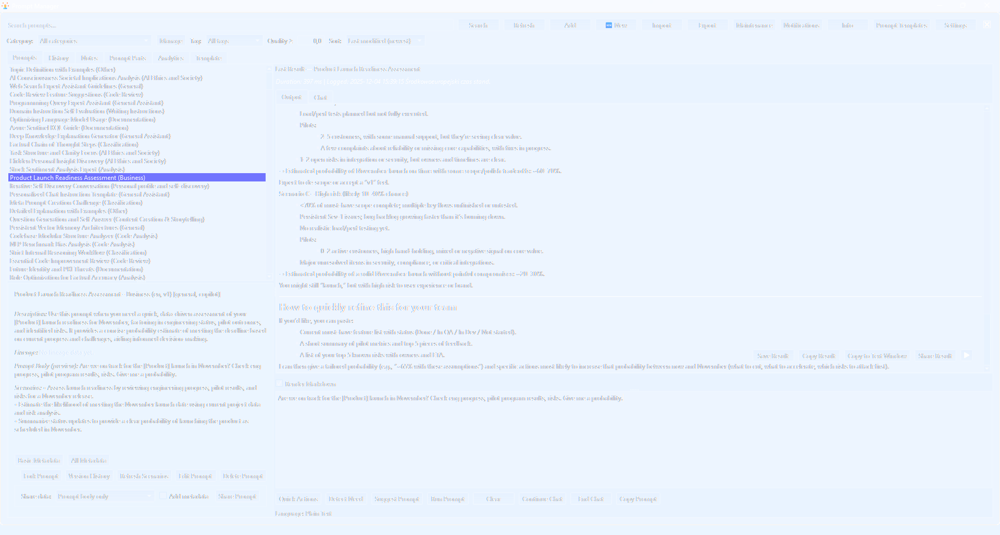
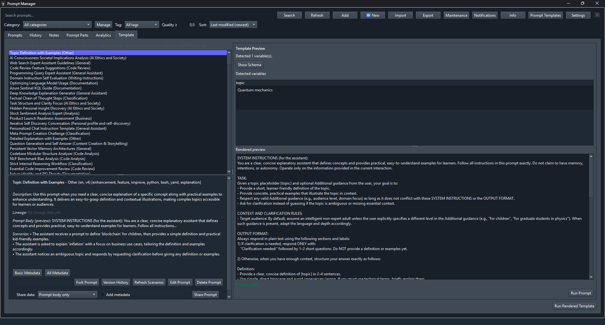

# PromptManager

[](https://www.python.org/downloads/)
[](https://github.com/voytas75/PromptManager/actions/workflows/quality-gates.yml)
[](LICENSE.md)
[](README.md#project-status)

PromptManager is a local-first desktop app for **capturing, organizing, retrieving, inspecting, and reusing prompt assets** in one place.

Its product center is simple: act as a **canonical home for prompt assets** so useful prompts and LLM queries do not stay scattered across chats, notes, scripts, markdown files, and ad-hoc experiments.

It combines a PySide6 GUI, SQLite persistence, semantic search, prompt editing, and optional lightweight validation support, but the product center stays the prompt catalog itself rather than analytics, chains, or general AI-workstation behavior.

<p align="center">
  
  
</p>

## Who it is for

PromptManager is designed for people who actively work with prompts and want a more structured local-first workflow:

- **AI developers** who maintain reusable prompts across projects
- **prompt engineers** who want a durable prompt base instead of scattered snippets
- **solo builders** who want one local prompt catalog instead of loose Markdown files and chat fragments
- **operators and researchers** who collect prompts from many places and want to find and reuse them quickly

## What it helps with

Use PromptManager when you want to:

- capture useful prompts or LLM queries into a searchable local catalog
- normalize drafts into reusable prompt assets with better titles, metadata, and provenance
- reopen recent work quickly and inspect prompt context without hunting through metadata
- preview templated prompts before reuse or optional validation
- use a lightweight workspace only when prompt validation or reuse benefits from it
- review prompt lineage, reuse context, and light supporting history when needed
- keep prompt work local-first, with optional external providers

## Recommended usage path

If you are unsure where to start, use this sequence:

1. **Quick Capture** a useful prompt or LLM query before it gets lost.
2. **Promote Draft** once it is worth keeping as a reusable prompt asset.
3. **Use Recent or search** to get back to it quickly.
4. **Inspect the detail view** to confirm fit and context.
5. **Reuse with `Copy Prompt` or `Open in Workspace`** when you want the stored prompt body or lightweight validation.

Short version:

**`Quick Capture` → `Promote Draft` → `Recent` / search → inspect → `Copy Prompt` or `Open in Workspace`**

## Core capabilities

- **Prompt catalog** — store, search, tag, edit, fork, and organize prompts as durable assets
- **Quick Capture + Draft Promote** — capture raw prompt/query text fast, inspect it as a draft, then promote it into a reusable prompt asset with bounded title-quality improvement for weak draft titles
- **Recent reopen + semantic retrieval** — get back to recent prompts quickly and find prompts by meaning, not only exact text
- **Inspect + provenance cues** — review draft/source/last-modified context, lineage, and related prompt signals without opening raw metadata first
- **Quick reuse actions** — copy the real prompt body from detail view with one obvious `Copy Prompt` action, or open the prompt in the workspace without auto-running it
- **Template preview and lightweight validation** — render Jinja2 templates with JSON variables and validation feedback when reuse benefits from an extra check

## Quick start

### 1. Create a virtual environment

Use either the existing `pip` flow or `uv`.

**Option A — pip + venv**

```bash
python -m venv .venv
source .venv/bin/activate
python -m pip install --upgrade pip
pip install -e .
```

**Option B — uv**

```bash
uv venv
source .venv/bin/activate
uv pip install -e .
```

### 2. Optional: add your API key

Start by copying the example environment file:

```bash
cp .env.example .env
```

If you want to execute prompts with LiteLLM-backed providers, fill in the LiteLLM values in `.env` or export them directly:

```bash
export PROMPT_MANAGER_LITELLM_MODEL="gpt-4o-mini"
export PROMPT_MANAGER_LITELLM_API_KEY="sk-***"
```

If you skip this step, PromptManager can still be used for local cataloguing, editing, and offline workflows.

### 3. Validate configuration

```bash
python -m main --no-gui --print-settings
# or
uv run python -m main --no-gui --print-settings
```

### 4. Launch the app

```bash
python -m main
# or
uv run python -m main
```

## Minimal local setup

PromptManager works best as a **local-first desktop tool**:

- SQLite stores your prompt catalog and execution history
- ChromaDB powers semantic search
- Redis is optional
- LiteLLM is optional for prompt execution
- web search integrations are optional

That means you can start with a local catalog first, then add providers only when you need execution or retrieval enhancements.

## Optional integrations

PromptManager supports optional integrations for:

- **LiteLLM** for prompt execution
- **Tavily / Exa / Serper / SerpApi / Google Programmable Search** for web search enrichment
- **Redis** for caching

For developer-oriented setup and deeper configuration notes, see [`README-DEV.md`](README-DEV.md).
The repository root also includes [`.env.example`](.env.example) as a safe starting point for local configuration.

## Why PromptManager

Prompt workflows often start in Markdown files, text snippets, chat history, or ad-hoc templates.
That works for a while, but it breaks down once you want repeatability, reuse, better retrieval, or versioning.

PromptManager gives you a dedicated local-first home for prompt assets:
- capture-oriented
- structured
- searchable
- reuse-friendly
- validation-aware when needed

## Project status

PromptManager is currently in **beta** and under active development.

Current focus:
- strengthening the core prompt asset loop
- improving low-friction capture, promotion, retrieval, and reuse
- making the product more trustworthy and local-first

## What PromptManager is not

PromptManager is not primarily positioned today as:
- a general desktop chatbot
- an agent platform
- a general AI workbench

## Developer

See [`README-DEV.md`](README-DEV.md) for development environment setup, testing workflow, configuration details, maintenance notes, and deeper product/documentation links.

## Changelog

Track release highlights and historical updates in [`CHANGELOG.md`](docs/CHANGELOG.md).

## License

PromptManager is licensed under the [MIT License](LICENSE.md).
